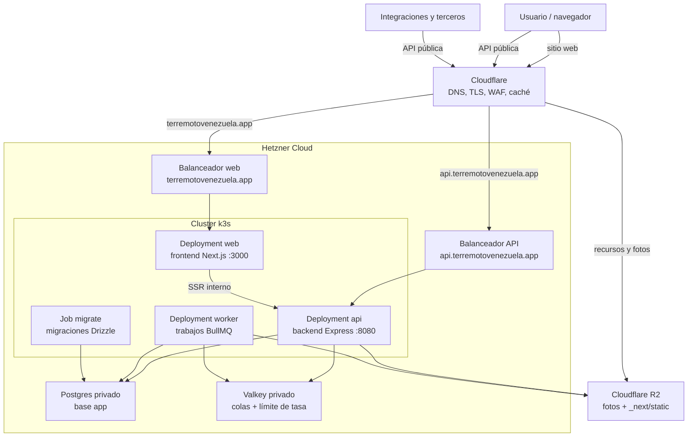

# Mapa de Emergencia y Rescate: Terremoto en Venezuela

Plataforma de reporte ciudadano en tiempo real para coordinar rescates,
identificar daños estructurales y organizar la entrega de ayuda humanitaria.

Construida como monorepo simple: **frontend Next.js (App Router)**,
**backend Express**, **Leaflet + OpenStreetMap** (sin clave de API) y
**Postgres** (acceso vía **Drizzle ORM**), con **workers BullMQ** para el trabajo
asíncrono.
Pensada para alto tráfico y para funcionar bien en móvil.

## Funcionalidad

- Mapa interactivo: toca/clic en un punto para abrir el formulario de reporte.
- 3 tipos de marcadores: 🔴 Emergencia crítica, 🟡 Suministros, 🟢 Centro de acopio.
- Panel lateral con lista de reportes, contadores y filtro por tipo.
- Botón "Atendido" para limpiar reportes ya resueltos.
- Refresco automático cada 5 s (sondeo), pausado cuando la pestaña no está visible.

## Diseño

El sistema visual vive en [`docs/design/DESIGN.md`](docs/design/DESIGN.md). Sigue el
formato DESIGN.md de Google para combinar tokens de diseño con criterios
humanos de uso, y debe revisarse antes de cambios visuales en la interfaz
pública.

## Optimizaciones para alto flujo de uso

- **Caché de CDN** en `GET /api/reports` (`s-maxage=4, stale-while-revalidate=30`):
  miles de usuarios haciendo sondeo se sirven desde el borde/CDN y no
  golpean la base de datos en cada petición.
- **Actualizaciones optimistas**: el reporte propio aparece al instante aunque el
  CDN sirva una versión en caché de la lista durante unos segundos.
- **Límite de tasa** por IP con Valkey y respaldo en memoria para frenar spam y
  reportes falsos.
- **Sondeo pausado** automáticamente cuando la pestaña está en segundo plano.

> `docker compose` inyecta `DATABASE_URL`, `VALKEY_URL` y las URLs locales entre
> frontend/backend. Si levantas paquetes a mano, define esas variables en el
> entorno correspondiente.

## Arquitectura actual



El frontend es responsable de la experiencia pública y no accede directo a la
base de datos. El navegador habla con la API por `NEXT_PUBLIC_API_URL`, mientras
que los componentes de servidor pueden usar `INTERNAL_API_URL` dentro de
Docker/k3s.
El backend concentra validación, CORS, Turnstile, límite de tasa, Drizzle y la
superficie `/api`; los workers usan Valkey/BullMQ para tareas largas como
sincronización, geocodificación, deduplicación, rellenos de datos y migración de
fotos a R2.

## Desarrollo local

```bash
docker compose up --build
```

Abre http://localhost:3000. El backend queda en http://localhost:8080 y Postgres
+ Valkey corren dentro de Docker.

También puedes levantar cada paquete por separado:

```bash
cd backend
npm install
npm run dev

cd ../frontend
npm install
npm run dev
```

## Contribuir

Antes de abrir una issue o pull request, lee [CONTRIBUTING.md](CONTRIBUTING.md).
El proyecto usa un flujo de fork primero para contribuciones externas,
plantillas de incidencias/PRs y reglas estrictas para no publicar datos
personales o sensibles en GitHub. Para vulnerabilidades o fugas de datos, usa
[`docs/SECURITY.md`](docs/SECURITY.md).

## Despliegue

El despliegue canónico es **Hetzner Cloud + k3s**, aprovisionado con **OpenTofu**
(`infra/tofu/`) y desplegado con manifiestos de Kubernetes (`infra/k8s/`). El
flujo de GitHub Actions `.github/workflows/deploy-hetzner.yml` construye las
imágenes, las publica en GHCR y aplica los manifiestos por entorno (`staging` |
`prod`).

Componentes principales del clúster:

- Dos `Deployment` de aplicación: `web` corre la imagen `frontend` (Next en
  `:3000`) y `api` corre la imagen `backend` (Express en `:8080`), cada uno con
  3 réplicas base y autoescalado por HPA (`web` 3–20, `api` 3–30, CPU 60%).
- Dos `Service` `LoadBalancer`: `web` → LB público (dominio del sitio) y `api` →
  LB para terceros. El perfil TLS se inyecta por entorno con `envsubst` (staging
  = certificado Origin tras Cloudflare; prod = certificado gestionado por
  Hetzner).
- Workers BullMQ (`worker-deployment.yaml`) para sincronización,
  geocodificación, deduplicación, realojamiento de imágenes y tareas
  programadas; el Job `migrate` aplica las migraciones de Drizzle
  (`backend/worker/migrate.ts`) antes del despliegue progresivo.
- Nodos efímeros con cluster-autoscaler de Hetzner: la configuración por defecto
  (`infra/tofu/variables.tf`, `k3s_worker_count = 0`) y los manifiestos apuntan a
  ese modelo. El runbook de cutover está en `docs/rfcs/0004-*` (aún con pasos
  manuales).

La base de datos es **Postgres** y el esquema es la **única fuente de verdad** en
`infra/db/schema.ts`: NO hay `CREATE TABLE` en tiempo de ejecución. Los cambios
se generan con `cd backend && npm run db:generate` (migraciones en
`infra/db/migrations/`) y el Job `migrate` los aplica de forma idempotente en
cada despliegue.

> Vercel/Neon pueden seguir presentes como alternativa o despliegue legado
> (`frontend/vercel.json` existe como legado), pero el camino soportado y
> descrito arriba es Hetzner + k3s.

Para desarrollo local completo usa Docker Compose:

```bash
docker compose up --build
```

## Estructura

Vista de alto nivel:

```
frontend/
  app/            # páginas Next, layout, estilos y componentes de app
  components/     # módulos visuales reutilizables
  hooks/          # TanStack Query + mutaciones HTTP
  lib/            # cliente API, tipos compartidos y helpers de UI
  public/         # recursos estáticos, PWA, openapi.json
backend/
  src/routes/     # superficie HTTP /api (Express)
  src/services/   # lógica de negocio
  src/middleware/ # validación, auth, límite de tasa, Turnstile
  src/db/         # acceso Drizzle a Postgres
  worker/         # BullMQ, sincronización, hub, migraciones/rellenos
infra/
  db/             # schema.ts + migraciones SQL de Drizzle
  k8s/            # manifiestos: web/api, servicios, HPA, workers, migración
  tofu/           # OpenTofu: red, k3s, postgres, valkey, firewall
docs/             # RFCs, ADRs, arquitectura y guías
```

El acceso a datos pasa por **Drizzle ORM** desde `backend/src/db`; el esquema y
sus tablas viven en `infra/db/schema.ts`. El documento de arquitectura actual
está en [`docs/architecture/architecture.md`](docs/architecture/architecture.md).
